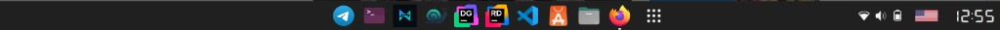

# Bottom Panel

Bottom dock/panel for **GNOME Shell 50**. Hides the default top bar and builds a bottom panel that reuses native Shell indicators (Quick Settings, clock/calendar, battery, network, audio) plus favorites and running apps.



## Features

- Hides the default GNOME top panel
- Bottom panel with rounded corners, margin, opacity, optional blur
- Running apps + favorites via stock `Dash.Dash`
- Clock / calendar / notifications via native `dateMenu`
- Quick Settings (network, Bluetooth, volume, brightness, battery, power menu)
- Adjustable tray icon size and right-side item order (clock / keyboard / system)
- Optional workspace indicator and keyboard layout indicator (flat flags)
- Configurable Apps (Start) button icon
- Dark / light theme adaptation, optional custom panel color
- Multi-monitor panels (system indicators on primary only)
- Optional intellihide auto-hide (visible on desktop; hides only with maximized windows)
- Preferences UI (Appearance / Layout / Behavior)

## Requirements

- GNOME Shell **50**
- `glib-compile-schemas`
- `rsync`, `zip` (for install / pack)

## Install

```bash
./install.sh
# or: make install
```

Then reload the Shell:

| Session | How to reload |
|--------|----------------|
| **X11** | `Alt+F2` → `r` → Enter |
| **Wayland** | Log out/in, or toggle the extension off/on |

```bash
gnome-extensions enable bottom-panel@mortenaho.github.io
gnome-extensions info bottom-panel@mortenaho.github.io
```

### Pack for extensions.gnome.org

```bash
./pack.sh
# → bottom-panel@mortenaho.github.io.zip
```

Upload that zip on [extensions.gnome.org](https://extensions.gnome.org/upload/).  
Also upload `screenshot.png` on the extension page after the first approved version.

## Debugging

```bash
journalctl -f -o cat /usr/bin/gnome-shell
# or: make logs
```

Looking Glass: `Alt+F2` → `lg`

## License

GPL-2.0-or-later. See [LICENSE](LICENSE).
